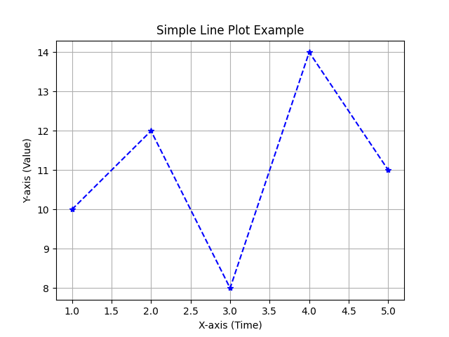
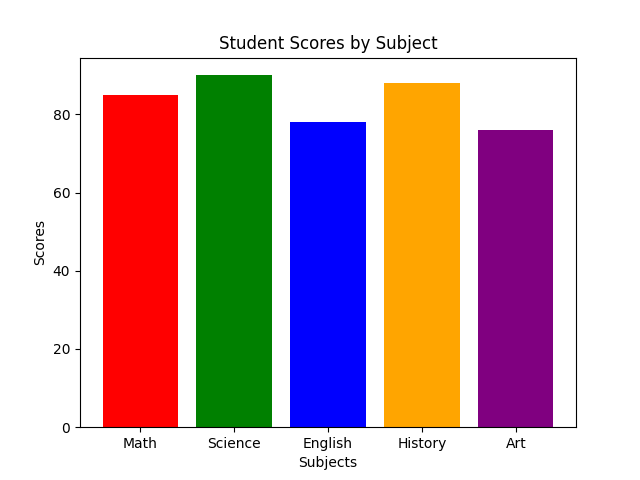
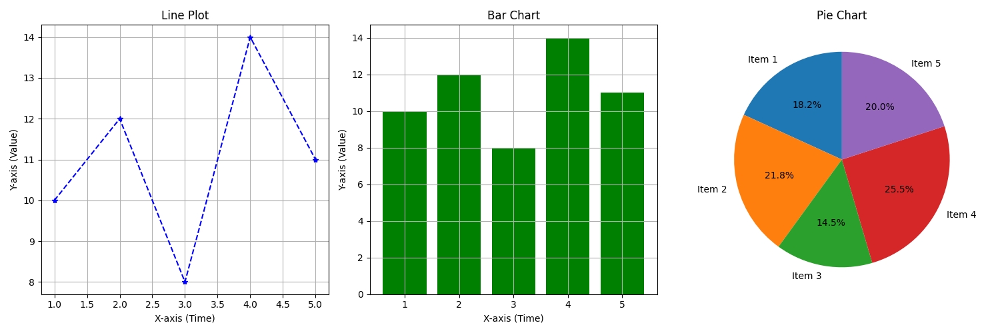

# Data Visualization

A beginner-friendly Python program demonstrating how to create basic plots using the `matplotlib` library.
This repository is part of my Python tutorials collection for learning data visualization.

### 1. Line Plot Program
A simple line chart created using Matplotlib to visualize data trends over time.  
Includes markers, custom line styles, axis labels, title, and a grid.
### 🔧 Code File:
- `Line_plot.py`
### 📈 Line Plot Output


### 2. Bar Chart Program
A basic bar chart showing student scores across different subjects using Matplotlib.  
Demonstrates labeled axes, colored bars, and a descriptive chart title.
### 🔧 Code File:
- `Bar_chart.py`
### 📊 Bar Chart Output


### 3. Subplot Program
This Python program visualizes a dataset using a line plot, bar chart, and pie chart in a single figure with subplots. It uses Matplotlib to display and save the combined chart as an image.
### 🔧 Code File:
- `subplot.py`
### 📊 Bar Chart Output


## 🚀 Getting Started

Make sure you have Python and matplotlib installed:

```bash
pip install matplotlib
